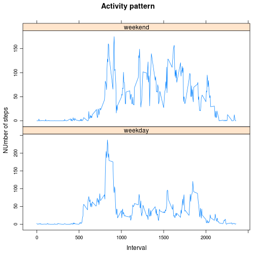

# Reproducible Research: Peer Assessment 1
Before running that code I had to install knitr package. If you have the same problem please try this option.

```r
install.packages('knitr', dependencies = T)
```

Loading the installed library.

```r
library(knitr)
```


## Loading and preprocessing the data
Show any code that is needed to

1. Load the data (i.e. read.csv())

2. Process/transform the data (if necessary) into a format suitable for your analysis

In this first step we will load the data into variable called data, and preprocess it to change the date column class from character to Date.

```r
data <- read.csv(unz("activity.zip", "activity.csv"), header=T, quote="\"", sep=",")
data$date <- as.Date(as.character(data$date), "%Y-%m-%d"); 
```

## What is mean total number of steps taken per day?

For this part of the assignment, you can ignore the missing values in the dataset.

1. Make a histogram of the total number of steps taken each day

2. Calculate and report the mean and median total number of steps taken per day

First we have to sum up all the steps for each day, and then use it to make the histogram(I arbitrarily decided to break it in 20). 


```r
totalStepsPerDay <- by(data$steps, data$date, function(x) sum(x ,na.rm=TRUE))
hist(totalStepsPerDay, breaks=20)
```

 

Now we can compute the mean and median values.

```r
meanStepsPerDay <- mean(totalStepsPerDay)
medianStepsPerDay <- median(totalStepsPerDay)
```

The mean value is 9354.2295 while the median is 10395.

## What is the average daily activity pattern?
1. Make a time series plot (i.e. type = "l") of the 5-minute interval (x-axis) and the average number of steps taken, averaged across all days (y-axis)

```r
stepsPerInterval <- by(data$steps, data$interval, function(x) mean(x ,na.rm=TRUE))
plot( unique(data$interval), stepsPerInterval, type="l")
```

 

2. Which 5-minute interval, on average across all the days in the dataset, contains the maximum number of steps?

```r
maxInterval <- as.integer(names(which.max(stepsPerInterval)))
```
The 5 minute interval with the maximum number of steps is 835.

## Imputing missing values
Note that there are a number of days/intervals where there are missing values (coded as NA). The presence of missing days may introduce bias into some calculations or summaries of the data.

1. Calculate and report the total number of missing values in the dataset (i.e. the total number of rows with NAs)

```r
nMissingValues <- sum(is.na(data$steps))
nTotal <- length(data$steps)
percMissingValues <- nMissingValues*100/nTotal
```

The number of total misssing values is 2304, which means a 13.1148% of the total.


2. Devise a strategy for filling in all of the missing values in the dataset. The strategy does not need to be sophisticated. For example, you could use the mean/median for that day, or the mean for that 5-minute interval, etc.

I have decided to respect the weekday patters. Therefore, I have decided using the interval average value calculated by weekday. In the next code you can see how I imput the new values.

2. Create a new dataset that is equal to the original dataset but with the missing data filled in.

The new data frame is called dataFilled, with the imputed values.

```r
data$weekday <- as.factor(weekdays(data$date)); 
data$interval_weekday <- as.factor(paste(data$interval,data$weekday, sep="_")); 
meanStepsPerIntervalWeekday <- by(data$steps, data$interval_weekday, function(x) mean(x ,na.rm=TRUE))
missingIndexes <- which(is.na(data$steps))
dataFilled <- data
for(i in missingIndexes){
  dataFilled[i,]$steps <- meanStepsPerIntervalWeekday[dataFilled[i,]$interval_weekday ]
}
```

4. Make a histogram of the total number of steps taken each day and Calculate and report the mean and median total number of steps taken per day. Do these values differ from the estimates from the first part of the assignment? What is the impact of imputing missing data on the estimates of the total daily number of steps?

To imput missing values I will do it using mean values by interval and weekday. So if first interval of a monday is missing it will be filled with the mean value of first interval steps on mondays. 
First we have to sum up all the steps for each day, and then use it to make the histogram(I arbitrarily decided to break it in 20). 

```r
newTotalStepsPerDay <- by(dataFilled$steps, dataFilled$date, function(x) sum(x ,na.rm=TRUE))
hist(newTotalStepsPerDay, breaks=20)
```

 

Now we can compute the new mean and median values.

```r
newMeanStepsPerDay <- mean(newTotalStepsPerDay)
newMedianStepsPerDay <- median(newTotalStepsPerDay)
```
The mean value is 1.0821 &times; 10<sup>4</sup> while the new median is 1.1015 &times; 10<sup>4</sup>. (I don't know why it is printed in scientific notation)

## Are there differences in activity patterns between weekdays and weekends?

For this part the weekdays() function may be of some help here. Use the dataset with the filled-in missing values for this part.

1. Create a new factor variable in the dataset with two levels – “weekday” and “weekend” indicating whether a given date is a weekday or weekend day.


```r
dataFilled$dayType <- ifelse((dataFilled$weekday == "Saturday" | dataFilled$weekday == "Sunday"), "weekend", "weekday")
```

Make a panel plot containing a time series plot (i.e. type = "l") of the 5-minute interval (x-axis) and the average number of steps taken, averaged across all weekday days or weekend days (y-axis). 

Create a new data frame with data of the stepsPerIntervalDayType, with the interval and day types.   


```r
dataFilled$interval_dayType <- as.factor(paste(dataFilled$interval,dataFilled$dayType, sep="_")); 

stepsPerIntervalDayType <- by(dataFilled$steps, dataFilled$interval_dayType, function(x) mean(x ,na.rm=TRUE))

SPIDT_df <- data.frame(as.vector(stepsPerIntervalDayType))
SPIDT_df$interval <- as.integer(NA)
SPIDT_df$dayType <- as.character(NA)

for( a in 1:length(stepsPerIntervalDayType)){
  SPIDT_df[a, ]$interval <- as.integer(strsplit(names(stepsPerIntervalDayType), "_")[[a]][1])
  SPIDT_df[a, ]$dayType <- strsplit(names(stepsPerIntervalDayType), "_")[[a]][2]
}

SPIDT_df <- SPIDT_df[order(SPIDT_df$dayType, SPIDT_df$interval), ]
names(SPIDT_df) <- c( "steps", "interval", "dayType")

#par(mfrow=c(2,1))
#plot(unique(SPIDT_df$interval),SPIDT_df$steps[SPIDT_df$dayType=="weekday"], main="Weekday pattern", type="l")
#plot(unique(SPIDT_df$interval),SPIDT_df$steps[SPIDT_df$dayType=="weekend"], main="Weekend pattern", type="l")

library(lattice)
xyplot(SPDIT_df$steps[SPIDT_df$dayType=="weekday"]|SPDIT_df$steps[SPIDT_df$dayType=="weekend"],data=SPDIT_df,type="l", scales=list(y=list(relation="free")), layout=c(2,1))
```

```
## Error: object 'SPDIT_df' not found
```

```r
xyplot(SPIDT_df$steps ~ SPIDT_df$interval| SPIDT_df$dayType,data=SPIDT_df,type="l", scales=list(y=list(relation="free")), layout=c(1,2))
```

 

#Option1
dt$time <- seq(nrow(dt))
library(reshape2)
mm <- melt(subset(dt,select=c(time,DEPTH,X,Y,Z)),id.var="time")
library(lattice)
xyplot(value~time|variable,data=mm,type="l",
       scales=list(y=list(relation="free")),
       layout=c(1,4))
#Option2
The basic idea is to melt the data set so that you have the values of the variables you want to plot on the y axis in a single column, with a second column distinguishing the source. For example:

data("economics")
dat.m <- melt(economics, measure.vars=c("pop", "unemploy"))
Then use facet_grid to plot each variable in a separate facet:

ggplot(dat.m, aes(x=date, y=value)) + geom_line() + facet_grid(variable~., scales="free_y")


       


## Set up par's to make 2 panel chart
par(bty="l")
par(ps=10)
par(mfrow=c(2,1))       # try to get two plots, one above the other
par(mar=c(0,4,0,1))     ## Set par(mar) to eliminate X axis gap
par(oma=c(2,2,2,2))

## Make Plot 1
plot(spIDT$steps[spIDT$dayType=="weekday"], type="l", lwd=2, ylab="Number of Steps")
grid(col = "lightgrey", lty=1)
lines(spIDT$steps, type="l", lwd=2)
axis(1, col="grey", at=NULL, labels=FALSE)
axis(2, col="black", labels=TRUE)
axis(3, col="grey", labels=TRUE)
box(col = "grey")

## Adjust par(mar) for 2nd plot
par(mar=c(2,4,0,1))

## Second plot
plot(spIDT$steps[spIDT$dayType=="weekend"], type="l", lwd=2, ylab="Number of Steps")
grid(col = "lightgrey", lty=1)
lines(M$date, M$cospi.PE, col="black", lwd=2)
axis(2, col="black", at=NULL, labels=T)
